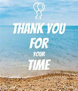

### this my GitHub main page: [Click here](https://github.com/Abdullah-Alabbadi)

---

# **Introduction about myself**

## hello my vistor I am Abdullah Alabbadi, I am 22 years old.

## I was graduated, majoring in Software Engineering,I have knowledge not bad in programming.

---

 

**Table of content Code 102 Reading Notes**

| Reading of classes            | Link                           |
| ----------------------------- | ------------------------------ |
| differences in text editors   | [Click here](Code102/read.md)  |
| information about repository  | [Click here](Code102/read1.md) |
| Growth mindset explan         | [Click here](Code102/read2.md) |
| Structure of HTML             | [Click here](Code102/read3.md) |
| JavaScript language           | [Click here](Code102/read4.md) |
| logical operators description | [Click here](Code102/read5.md) |
| Conclusion about Color in JS  | [Click here](Code102/read6.md) |

---

 

**Table of content Code 201 Reading Notes**

| Reading of classes                                                 | Link                               |
| ------------------------------------------------------------------ | ---------------------------------- |
| Read: 01 - Introductory HTML and JavaScript                        | [Click here](Code201/class-01.md)  |
| Read: 02 - CSS, javaScript Introducing and Instructions            | [Click here](Code201/class-02.md)  |
| Read: 03 - HTML Lists, Control Flow with JS, and the CSS Box Model | [Click here](Code201/class-03.md)  |
| Read: 04 - HTML Links, JS Functions, and Intro to CSS Layout       | [Click here](Code201/class-04.md)  |
| Read: 05 - HTML Images; CSS Color & Text                           | [Click here](Code201/class-05.md)  |
| Read: 06 - Object Literals; The DOM                                | [Click here](Code201/class-06.md)  |
| Read: 07 - HTML Tables; JS Constructor Functions                   | [Click here](Code201/class-07.md)  |
| Read: 08 - More CSS Layout                                         | [Click here](Code201/class-08.md)  |
| Read: 09 - Forms and Events                                        | [Click here](Code201/class-09.md)  |
| Read: 10 - JS Debugging                                            | [Click here](Code201/class-10.md)  |
| Read: 11 - Assorted Topics                                         | [Click here](Code201/class-11.md)  |
| Read: 12 - Docs for the HTMLElement & Chart.js                     | [Click here](Code201/class-12.md)  |
| Read: 13 - Local Storage                                           | [Click here](Code201/class-13.md)  |
| Read: 14a - CSS Transforms, Transitions, and Animations            | [Click here](Code201/class-14.md)  |
| Read: 14b - What Google Learned About Teams                        | [Click here](Code201/class-14b.md) |

---

### For more information Follow me :)

